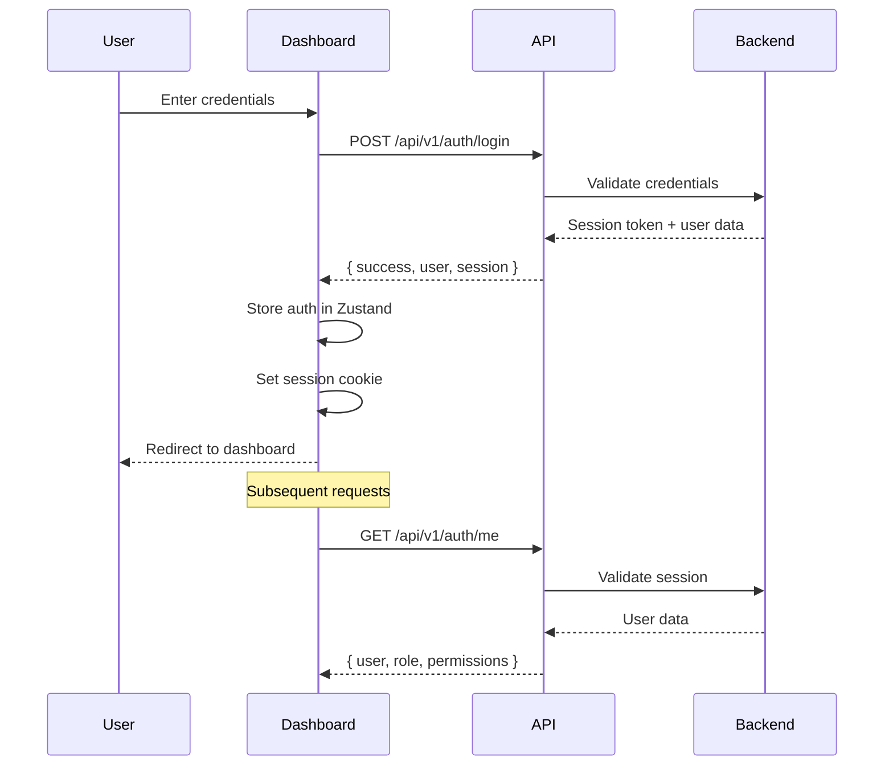
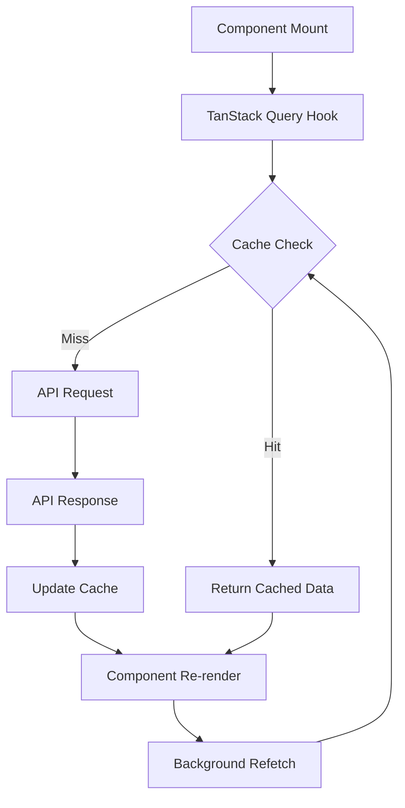
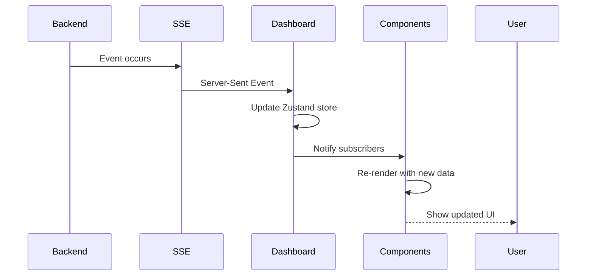

# TelePayGate Dashboard Architecture

## Executive Summary

Comprehensive architecture for a modern, clean, and functional dashboard for the TelePayGate payment gateway platform. Built with Next.js 14/15 App Router, TypeScript, and shadcn/ui for a premium user experience.

---

## 1. Technology Stack Selection

### Core Technologies

| Layer | Technology | Rationale |
|--------|-------------|------------|
| **Frontend Framework** | Next.js 14/15 (App Router) | Modern React framework with built-in SSR, routing, and optimization |
| **UI Component Library** | shadcn/ui | Beautiful, accessible, customizable components built on Radix UI |
| **Styling** | Tailwind CSS | Utility-first CSS, excellent DX, responsive design |
| **State Management** | Zustand + TanStack Query | Zustand for global auth state, TanStack Query for server state |
| **Data Fetching** | TanStack Query (React Query) | Powerful caching, optimistic updates, background refetching |
| **Forms** | React Hook Form + Zod | Type-safe forms with runtime validation |
| **Charts** | Recharts | Lightweight, customizable data visualization |
| **Icons** | Lucide React | Consistent icon system |
| **Real-time Updates** | Server-Sent Events (SSE) | Efficient real-time data streaming |
| **TypeScript** | Full type safety | End-to-end type safety with backend types |
| **Testing** | Vitest + Playwright | Unit and E2E testing |
| **Build Tool** | Turbopack (Next.js 15) | Fast builds and hot reload |

### Why This Stack?

- **Next.js 14/15**: App Router provides excellent DX, built-in optimizations, SEO support, and server components
- **shadcn/ui**: Modern, accessible components that can be customized to match brand
- **TanStack Query**: Best-in-class data fetching with caching, deduplication, and optimistic updates
- **Zustand**: Lightweight state management perfect for auth and theme
- **TypeScript**: Full type safety from backend to frontend

---

## 2. Project Structure

```
packages/dashboard/
├── app/
│   ├── (auth)/                    # Auth routes group
│   │   ├── login/
│   │   │   └── page.tsx
│   │   ├── register/
│   │   │   └── page.tsx
│   │   └── layout.tsx
│   ├── (dashboard)/                # Protected dashboard routes
│   │   ├── layout.tsx            # Dashboard shell with sidebar
│   │   ├── page.tsx              # Dashboard home
│   │   ├── payments/
│   │   │   ├── page.tsx          # Payments list
│   │   │   ├── [id]/
│   │   │   │   └── page.tsx      # Payment details
│   │   │   └── stats/
│   │   │       └── page.tsx      # Payment analytics
│   │   ├── conversions/
│   │   │   ├── page.tsx          # Conversions list
│   │   │   ├── [id]/
│   │   │   │   └── page.tsx      # Conversion details
│   │   │   ├── new/
│   │   │   │   └── page.tsx      # Create conversion
│   │   │   └── rates/
│   │   │       └── page.tsx      # Rate management
│   │   ├── p2p/
│   │   │   ├── page.tsx          # P2P marketplace
│   │   │   ├── orders/
│   │   │   │   ├── page.tsx      # My orders
│   │   │   │   └── new/
│   │   │   │       └── page.tsx  # Create order
│   │   │   └── matching/
│   │   │       └── page.tsx      # Order matching visualization
│   │   ├── dex/
│   │   │   ├── page.tsx          # DEX overview
│   │   │   ├── pools/
│   │   │   │   └── page.tsx      # Liquidity pools
│   │   │   ├── routes/
│   │   │   │   └── page.tsx      # Best routes
│   │   │   └── swap/
│   │   │       └── page.tsx      # Swap interface
│   │   ├── webhooks/
│   │   │   ├── page.tsx          # Webhook configuration
│   │   │   ├── history/
│   │   │   │   └── page.tsx      # Event history
│   │   │   └── test/
│   │   │       └── page.tsx      # Test delivery
│   │   ├── users/
│   │   │   ├── page.tsx          # User list (admin)
│   │   │   ├── [id]/
│   │   │   │   └── page.tsx      # User details
│   │   │   └── profile/
│   │   │       └── page.tsx      # My profile
│   │   ├── admin/
│   │   │   ├── page.tsx          # Admin overview
│   │   │   ├── revenue/
│   │   │   │   └── page.tsx      # Revenue analytics
│   │   │   ├── fees/
│   │   │   │   └── page.tsx      # Fee management
│   │   │   └── config/
│   │   │       └── page.tsx      # Platform configuration
│   │   ├── nitro/
│   │   │   ├── page.tsx          # Nitro swaps
│   │   │   ├── [txHash]/
│   │   │   │   └── page.tsx      # Swap details
│   │   │   └── metrics/
│   │   │       └── page.tsx      # Nitro metrics
│   │   └── settings/
│   │       └── page.tsx          # User settings
│   ├── api/                      # API routes (if needed)
│   │   └── auth/
│   │       └── [...nextauth]/
│   │           └── route.ts
│   ├── components/
│   │   ├── ui/                  # shadcn/ui components
│   │   ├── layout/               # Layout components
│   │   │   ├── Sidebar.tsx
│   │   │   ├── Header.tsx
│   │   │   ├── Footer.tsx
│   │   │   └── MobileNav.tsx
│   │   ├── payments/             # Payment-specific components
│   │   ├── conversions/          # Conversion components
│   │   ├── p2p/                 # P2P components
│   │   ├── dex/                 # DEX components
│   │   ├── webhooks/             # Webhook components
│   │   ├── admin/               # Admin components
│   │   ├── charts/              # Chart components
│   │   ├── tables/              # Data table components
│   │   └── forms/               # Form components
│   ├── lib/
│   │   ├── api/                 # API client functions
│   │   │   ├── client.ts        # API client setup
│   │   │   ├── payments.ts
│   │   │   ├── conversions.ts
│   │   │   ├── dex.ts
│   │   │   ├── p2p.ts
│   │   │   ├── webhooks.ts
│   │   │   ├── users.ts
│   │   │   ├── admin.ts
│   │   │   ├── fees.ts
│   │   │   ├── nitro.ts
│   │   │   └── auth.ts
│   │   ├── hooks/               # Custom hooks
│   │   │   ├── useAuth.ts
│   │   │   ├── usePermissions.ts
│   │   │   ├── useRealtime.ts
│   │   │   └── useToast.ts
│   │   ├── store/               # Zustand stores
│   │   │   ├── authStore.ts
│   │   │   └── themeStore.ts
│   │   ├── utils/               # Utility functions
│   │   │   ├── format.ts
│   │   │   ├── validation.ts
│   │   │   └── constants.ts
│   │   ├── types/               # TypeScript types
│   │   │   ├── api.ts           # API response types
│   │   │   ├── models.ts        # Domain models
│   │   │   └── index.ts
│   │   └── validators/          # Zod schemas
│   │       ├── payments.ts
│   │       ├── conversions.ts
│   │       └── users.ts
│   ├── styles/
│   │   └── globals.css
│   └── public/
│       └── assets/
├── components.json               # shadcn/ui config
├── tailwind.config.ts
├── tsconfig.json
├── next.config.ts
├── vitest.config.ts
└── playwright.config.ts
```

---

## 3. Component Architecture

### Component Hierarchy

```
App
├── AuthLayout
│   ├── LoginForm
│   └── RegisterForm
├── DashboardLayout
│   ├── Sidebar
│   │   ├── SidebarNav
│   │   └── SidebarItem
│   ├── Header
│   │   ├── UserMenu
│   │   ├── ThemeToggle
│   │   └── Notifications
│   └── MainContent
│       ├── DashboardHome
│       ├── PaymentsPage
│       │   ├── PaymentsTable
│       │   ├── PaymentFilters
│       │   └── PaymentDetails
│       ├── ConversionsPage
│       │   ├── ConversionsTable
│       │   ├── ConversionForm
│       │   ├── RateLockWidget
│       │   └── ConversionProgress
│       ├── P2PPage
│       │   ├── OrdersTable
│       │   ├── CreateOrderForm
│       │   └── MatchingVisualization
│       ├── DEXPage
│       │   ├── RatesTable
│       │   ├── PoolsList
│       │   ├── RouteCalculator
│       │   └── SwapInterface
│       ├── WebhooksPage
│       │   ├── WebhookConfig
│       │   ├── EventHistory
│       │   └── TestDelivery
│       ├── UsersPage
│       │   ├── UsersTable
│       │   ├── UserDetails
│       │   └── ProfileForm
│       ├── AdminPage
│       │   ├── StatsOverview
│       │   ├── RevenueChart
│       │   ├── FeeConfig
│       │   └── PlatformSettings
│       ├── NitroPage
│       │   ├── SwapsTable
│       │   ├── SwapDetails
│       │   └── MetricsDashboard
│       └── SettingsPage
│           ├── APICredentials
│           ├── NotificationSettings
│           └── Preferences
```

### Component Design Principles

1. **Server Components First**: Use Server Components by default for data fetching
2. **Client Components Only When Needed**: Interactive elements, forms, real-time updates
3. **Composition Over Inheritance**: Build complex UIs from simple, reusable components
4. **Prop Drilling Minimization**: Use Context/Zustand for shared state
5. **Component Co-location**: Keep components with their styles, hooks, and utilities

---

## 4. Data Flow Architecture

### Authentication Flow



### Data Fetching Flow



### Real-time Updates Flow



---

## 5. API Integration Strategy

### API Client Architecture

```typescript
// lib/api/client.ts
import axios from 'axios';

const apiClient = axios.create({
  baseURL: process.env.NEXT_PUBLIC_API_URL || 'http://localhost:3000/api/v1',
  timeout: 30000,
  headers: {
    'Content-Type': 'application/json',
  },
});

// Request interceptor for auth
apiClient.interceptors.request.use((config) => {
  const session = getCookie('session');
  if (session) {
    config.headers.Cookie = `session=${session}`;
  }
  return config;
});

// Response interceptor for errors
apiClient.interceptors.response.use(
  (response) => response,
  (error) => {
    if (error.response?.status === 401) {
      // Redirect to login
      window.location.href = '/login';
    }
    return Promise.reject(error);
  }
);

export default apiClient;
```

### API Module Structure

```typescript
// lib/api/payments.ts
import apiClient from './client';
import { useQuery, useMutation, useQueryClient } from '@tanstack/react-query';

// Types
export interface Payment {
  id: string;
  userId: string;
  starsAmount: number;
  status: 'pending' | 'received' | 'converting' | 'converted' | 'settled' | 'failed';
  createdAt: string;
}

// Query hooks
export function usePayments(filters?: PaymentFilters) {
  return useQuery({
    queryKey: ['payments', filters],
    queryFn: async () => {
      const { data } = await apiClient.get('/payments', { params: filters });
      return data.payments;
    },
  });
}

export function usePayment(id: string) {
  return useQuery({
    queryKey: ['payment', id],
    queryFn: async () => {
      const { data } = await apiClient.get(`/payments/${id}`);
      return data.payment;
    },
  });
}

// Mutation hooks
export function useCreateConversion() {
  const queryClient = useQueryClient();

  return useMutation({
    mutationFn: async (data: CreateConversionInput) => {
      const response = await apiClient.post('/conversions/create', data);
      return response.data;
    },
    onSuccess: () => {
      queryClient.invalidateQueries({ queryKey: ['conversions'] });
      queryClient.invalidateQueries({ queryKey: ['payments'] });
    },
  });
}
```

### Error Handling Strategy

```typescript
// lib/utils/error-handler.ts
export class APIError extends Error {
  constructor(
    public code: string,
    message: string,
    public statusCode: number
  ) {
    super(message);
  }
}

export function handleAPIError(error: unknown): APIError {
  if (axios.isAxiosError(error)) {
    const data = error.response?.data;
    return new APIError(
      data?.error?.code || 'UNKNOWN_ERROR',
      data?.error?.message || 'An error occurred',
      error.response?.status || 500
    );
  }
  return new APIError('UNKNOWN_ERROR', 'An unknown error occurred', 500);
}
```

---

## 6. State Management Plan

### Global State (Zustand)

```typescript
// lib/store/authStore.ts
import { create } from 'zustand';
import { persist } from 'zustand/middleware';

interface AuthState {
  user: User | null;
  session: string | null;
  isAuthenticated: boolean;
  login: (user: User, session: string) => void;
  logout: () => void;
}

export const useAuthStore = create<AuthState>()(
  persist(
    (set) => ({
      user: null,
      session: null,
      isAuthenticated: false,
      login: (user, session) => set({ user, session, isAuthenticated: true }),
      logout: () => set({ user: null, session: null, isAuthenticated: false }),
    }),
    { name: 'auth-storage' }
  )
);

// lib/store/themeStore.ts
interface ThemeState {
  theme: 'light' | 'dark' | 'system';
  setTheme: (theme: 'light' | 'dark' | 'system') => void;
}

export const useThemeStore = create<ThemeState>()(
  persist(
    (set) => ({
      theme: 'system',
      setTheme: (theme) => set({ theme }),
    }),
    { name: 'theme-storage' }
  )
);
```

### Server State (TanStack Query)

- **Payments**: `usePayments()`, `usePayment()`, `usePaymentStats()`
- **Conversions**: `useConversions()`, `useConversion()`, `useConversionHistory()`
- **DEX**: `useDEXRates()`, `useLiquidityPools()`, `useBestRoute()`
- **P2P**: `useP2POrders()`, `useP2POrder()`
- **Webhooks**: `useWebhooks()`, `useWebhookEvents()`
- **Users**: `useUsers()`, `useUser()`, `useUserProfile()`
- **Admin**: `useAdminStats()`, `useRevenue()`, `useFeeConfig()`
- **Nitro**: `useNitroSwaps()`, `useNitroMetrics()`

### Local State (React useState)

- Form inputs
- UI toggles (modals, dropdowns)
- Temporary selections
- Component-specific state

---

## 7. Routing Strategy

### Route Structure

```typescript
// app/(dashboard)/layout.tsx
import { Sidebar } from '@/components/layout/Sidebar';
import { Header } from '@/components/layout/Header';

export default function DashboardLayout({ children }: { children: React.ReactNode }) {
  return (
    <div className="flex h-screen bg-background">
      <Sidebar />
      <div className="flex-1 flex flex-col">
        <Header />
        <main className="flex-1 overflow-auto p-6">
          {children}
        </main>
      </div>
    </div>
  );
}

// Route protection middleware
export const dynamic = 'force-dynamic';
```

### Route Groups

- **(auth)**: Public authentication routes (login, register)
- **(dashboard)**: Protected routes requiring authentication
- **api**: API routes for server-side operations

### Navigation

```typescript
// components/layout/Sidebar.tsx
const navItems = [
  { href: '/dashboard', label: 'Dashboard', icon: LayoutDashboard },
  { href: '/dashboard/payments', label: 'Payments', icon: CreditCard },
  { href: '/dashboard/conversions', label: 'Conversions', icon: ArrowRightLeft },
  { href: '/dashboard/p2p', label: 'P2P Marketplace', icon: Users },
  { href: '/dashboard/dex', label: 'DEX', icon: TrendingUp },
  { href: '/dashboard/webhooks', label: 'Webhooks', icon: Webhook },
  { href: '/dashboard/users', label: 'Users', icon: UserCog, adminOnly: true },
  { href: '/dashboard/admin', label: 'Admin', icon: Settings, adminOnly: true },
  { href: '/dashboard/nitro', label: 'Nitro Swaps', icon: Zap },
  { href: '/dashboard/settings', label: 'Settings', icon: Settings },
];
```

---

## 8. Security Architecture

### Authentication Methods

1. **Session-based Auth** (Primary for dashboard users)
   - Magic link authentication
   - Email + password
   - TOTP (2FA)
   - Session cookies with httpOnly, secure, sameSite

2. **API Key Auth** (For API clients)
   - X-API-Key header
   - Authorization: Bearer header
   - Query parameter fallback

### Authorization

```typescript
// lib/hooks/usePermissions.ts
export function usePermissions() {
  const { user } = useAuthStore();

  const hasPermission = (permission: string) => {
    if (!user) return false;
    const rolePermissions = ROLE_PERMISSIONS[user.role];
    return rolePermissions?.includes(permission);
  };

  const isAdmin = () => user?.role === 'admin';
  const isEditor = () => ['admin', 'editor'].includes(user?.role);
  const isViewer = () => ['admin', 'editor', 'viewer'].includes(user?.role);

  return { hasPermission, isAdmin, isEditor, isViewer };
}

// Role-based access
const ROLE_PERMISSIONS = {
  admin: ['*'], // Full access
  editor: [
    'payments:read', 'payments:write',
    'conversions:read', 'conversions:write',
    'webhooks:read', 'webhooks:write',
    'users:read',
  ],
  viewer: [
    'payments:read',
    'conversions:read',
    'webhooks:read',
  ],
  dev: ['*'], // Development access
};
```

### Data Protection

- **API Key Storage**: Never expose in client-side code
- **Session Management**: Secure httpOnly cookies
- **CSRF Protection**: CSRF tokens for state-changing operations
- **XSS Prevention**: React's built-in escaping, Content Security Policy
- **Input Validation**: Zod schemas on all inputs
- **Rate Limiting**: Respect backend rate limits

---

## 9. Performance Optimization Plan

### Code Splitting

```typescript
// Dynamic imports for route-level splitting
const PaymentDetails = dynamic(() => import('@/components/payments/PaymentDetails'), {
  loading: () => <Skeleton className="h-64" />,
});

// Component-level splitting
const HeavyChart = dynamic(() => import('@/components/charts/HeavyChart'), {
  ssr: false, // Client-only for performance
});
```

### Data Fetching Optimization

```typescript
// TanStack Query configuration
const queryClient = new QueryClient({
  defaultOptions: {
    queries: {
      staleTime: 5 * 60 * 1000, // 5 minutes
      cacheTime: 10 * 60 * 1000, // 10 minutes
      refetchOnWindowFocus: false,
      refetchOnReconnect: true,
      retry: (failureCount, error) => {
        if (error.status === 404) return false;
        if (failureCount < 3) return true;
        return false;
      },
    },
    mutations: {
      retry: 1,
    },
  },
});
```

### Bundle Optimization

```typescript
// next.config.ts
const nextConfig = {
  // Turbopack for faster builds (Next.js 15)
  experimental: {
    turbo: {},
  },
  // Optimize images
  images: {
    formats: ['image/avif', 'image/webp'],
    deviceSizes: [640, 750, 828, 1080, 1200],
  },
  // Bundle analysis
  webpack: (config) => {
    if (process.env.ANALYZE === 'true') {
      const { BundleAnalyzerPlugin } = require('@next/bundle-analyzer');
      config.plugins.push(new BundleAnalyzerPlugin());
    }
    return config;
  },
};
```

### Caching Strategy

- **Static Assets**: CDN caching with long TTL
- **API Responses**: TanStack Query cache with background refetch
- **Images**: Next.js Image optimization with AVIF/WebP
- **Route Caching**: ISR for semi-static pages

---

## 10. UI/UX Design

### Design Principles

1. **Clean & Minimal**: Reduce visual clutter, focus on data
2. **Consistent**: Use shadcn/ui components consistently
3. **Responsive**: Mobile-first design, breakpoints at 640px, 768px, 1024px
4. **Accessible**: WCAG AA compliance, keyboard navigation, screen readers
5. **Fast**: Instant page transitions, optimistic updates

### Color Scheme

```typescript
// Tailwind config - light mode
colors: {
  background: 'hsl(0 0% 100%)',
  foreground: 'hsl(222.2 84% 4.9%)',
  primary: {
    DEFAULT: 'hsl(221.2 83.2% 53.3%)',
    foreground: 'hsl(210 40% 98%)',
  },
  success: 'hsl(142.1 76.2% 36.3%)',
  warning: 'hsl(38 92% 50%)',
  danger: 'hsl(0 84.2% 60.2%)',
}

// Dark mode
darkMode: 'class',
```

### Typography

```typescript
// Inter font family
fontFamily: {
  sans: ['Inter', 'sans-serif'],
  mono: ['JetBrains Mono', 'monospace'],
},
```

### Component Examples

#### Data Table with Filtering

```typescript
// components/tables/DataTable.tsx
import { Table, TableBody, TableCell, TableHead, TableHeader, TableRow } from '@/components/ui/table';
import { Input } from '@/components/ui/input';
import { Button } from '@/components/ui/button';

export function DataTable<T>({ data, columns, filters }: DataTableProps<T>) {
  const [filter, setFilter] = useState('');

  const filteredData = data.filter((item) =>
    columns.some((col) =>
      String(item[col.key]).toLowerCase().includes(filter.toLowerCase())
    )
  );

  return (
    <div className="space-y-4">
      <Input
        placeholder="Filter..."
        value={filter}
        onChange={(e) => setFilter(e.target.value)}
        className="max-w-sm"
      />
      <Table>
        <TableHeader>
          <TableRow>
            {columns.map((col) => (
              <TableHead key={col.key}>{col.label}</TableHead>
            ))}
          </TableRow>
        </TableHeader>
        <TableBody>
          {filteredData.map((row, i) => (
            <TableRow key={i}>
              {columns.map((col) => (
                <TableCell key={col.key}>
                  {col.render ? col.render(row[col.key]) : row[col.key]}
                </TableCell>
              ))}
            </TableRow>
          ))}
        </TableBody>
      </Table>
    </div>
  );
}
```

#### Status Badge

```typescript
// components/ui/status-badge.tsx
import { Badge } from '@/components/ui/badge';

interface StatusBadgeProps {
  status: 'pending' | 'received' | 'converting' | 'converted' | 'settled' | 'failed';
}

export function StatusBadge({ status }: StatusBadgeProps) {
  const variants = {
    pending: 'secondary',
    received: 'default',
    converting: 'warning',
    converted: 'success',
    settled: 'success',
    failed: 'destructive',
  } as const;

  return <Badge variant={variants[status]}>{status}</Badge>;
}
```

---

## 11. Real-time Updates

### Server-Sent Events (SSE)

```typescript
// lib/hooks/useRealtime.ts
export function useRealtime(channel: string, onMessage: (data: any) => void) {
  const [isConnected, setIsConnected] = useState(false);

  useEffect(() => {
    const eventSource = new EventSource(
      `${process.env.NEXT_PUBLIC_API_URL}/api/v1/sse/${channel}`
    );

    eventSource.onopen = () => setIsConnected(true);
    eventSource.onmessage = (event) => {
      const data = JSON.parse(event.data);
      onMessage(data);
    };
    eventSource.onerror = () => setIsConnected(false);

    return () => eventSource.close();
  }, [channel, onMessage]);

  return { isConnected };
}
```

### Real-time Use Cases

- **Payment Status Updates**: When payment webhook is received
- **Conversion Progress**: Phase changes in conversion process
- **P2P Order Matching**: When orders are matched
- **DEX Rate Changes**: Real-time exchange rate updates
- **Webhook Events**: Delivery status updates

---

## 12. Testing Strategy

### Unit Testing (Vitest)

```typescript
// components/payments/__tests__/PaymentTable.test.tsx
import { describe, it, expect } from 'vitest';
import { render, screen } from '@testing-library/react';
import { PaymentTable } from '../PaymentTable';

describe('PaymentTable', () => {
  it('renders payments correctly', () => {
    const payments = [
      { id: '1', starsAmount: 1000, status: 'received' },
      { id: '2', starsAmount: 2000, status: 'pending' },
    ];

    render(<PaymentTable payments={payments} />);

    expect(screen.getByText('1000')).toBeInTheDocument();
    expect(screen.getByText('2000')).toBeInTheDocument();
  });

  it('filters payments by status', () => {
    // Test filtering logic
  });
});
```

### Integration Testing

```typescript
// lib/api/__tests__/payments.test.ts
import { describe, it, expect, beforeAll } from 'vitest';
import { apiClient } from '../client';

describe('Payments API', () => {
  beforeAll(() => {
    // Setup test database
  });

  it('fetches payments list', async () => {
    const response = await apiClient.get('/payments');
    expect(response.data.payments).toBeInstanceOf(Array);
  });

  it('creates payment', async () => {
    const payment = { starsAmount: 1000 };
    const response = await apiClient.post('/payments', payment);
    expect(response.data.payment).toBeDefined();
  });
});
```

### E2E Testing (Playwright)

```typescript
// e2e/payments.spec.ts
import { test, expect } from '@playwright/test';

test('user can view payments', async ({ page }) => {
  await page.goto('/dashboard/payments');
  await expect(page.locator('h1')).toHaveText('Payments');
  await expect(page.locator('table')).toBeVisible();
});

test('user can filter payments', async ({ page }) => {
  await page.goto('/dashboard/payments');
  await page.fill('input[placeholder="Filter..."]', 'received');
  await expect(page.locator('table tbody tr')).toHaveCount(1);
});
```

### Test Coverage Goals

- **Unit Tests**: 80%+ coverage
- **Integration Tests**: Critical API paths
- **E2E Tests**: Key user journeys
- **Visual Regression**: shadcn/ui components

---

## 13. Deployment Configuration

### Docker Configuration

```dockerfile
# packages/dashboard/Dockerfile
FROM node:20-alpine AS base

# Install dependencies
FROM base AS deps
WORKDIR /app
COPY package.json package-lock.json ./
RUN npm ci

# Build application
FROM base AS builder
WORKDIR /app
COPY --from=deps /app/node_modules ./node_modules
COPY . .
RUN npm run build

# Production image
FROM base AS runner
WORKDIR /app
ENV NODE_ENV=production

RUN addgroup --system --gid 1001 nodejs
RUN adduser --system --uid 1001 nextjs

COPY --from=builder /app/public ./public
COPY --from=builder --chown=nextjs:nodejs /app/.next/standalone ./
COPY --from=builder --chown=nextjs:nodejs /app/.next/static ./.next/static

USER nextjs
EXPOSE 3000
ENV PORT=3000
ENV HOSTNAME="0.0.0.0"

CMD ["node", "server.js"]
```

### Kubernetes Deployment

```yaml
# k8s/dashboard-deployment.yaml
apiVersion: apps/v1
kind: Deployment
metadata:
  name: telepaygate-dashboard
spec:
  replicas: 3
  selector:
    matchLabels:
      app: telepaygate-dashboard
  template:
    metadata:
      labels:
        app: telepaygate-dashboard
    spec:
      containers:
      - name: dashboard
        image: telepaygate/dashboard:latest
        ports:
        - containerPort: 3000
        env:
        - name: NEXT_PUBLIC_API_URL
          valueFrom:
            configMapKeyRef:
              name: telepaygate-config
              key: api-url
        resources:
          requests:
            memory: "256Mi"
            cpu: "250m"
          limits:
            memory: "512Mi"
            cpu: "500m"
        livenessProbe:
          httpGet:
            path: /health
            port: 3000
          initialDelaySeconds: 30
          periodSeconds: 10
        readinessProbe:
          httpGet:
            path: /health
            port: 3000
          initialDelaySeconds: 5
          periodSeconds: 5
---
apiVersion: v1
kind: Service
metadata:
  name: telepaygate-dashboard
spec:
  selector:
    app: telepaygate-dashboard
  ports:
  - protocol: TCP
    port: 80
    targetPort: 3000
  type: LoadBalancer
```

### Environment Configuration

```bash
# .env.production
NEXT_PUBLIC_API_URL=https://api.telepaygate.com/api/v1
NEXT_PUBLIC_APP_URL=https://dashboard.telepaygate.com
NEXT_PUBLIC_SENTRY_DSN=your-sentry-dsn
NEXT_PUBLIC_ANALYTICS_ID=your-analytics-id
```

---

## 14. Monitoring & Observability

### Error Tracking (Sentry)

```typescript
// sentry.client.config.ts
import * as Sentry from '@sentry/nextjs';

Sentry.init({
  dsn: process.env.NEXT_PUBLIC_SENTRY_DSN,
  environment: process.env.NODE_ENV,
  tracesSampleRate: 0.1,
  replaysSessionSampleRate: 0.1,
  replaysOnErrorSampleRate: 1.0,
  integrations: [
    new Sentry.BrowserTracing(),
    new Sentry.Replay(),
  ],
});
```

### Analytics

```typescript
// lib/utils/analytics.ts
export function trackEvent(name: string, properties?: Record<string, any>) {
  if (typeof window !== 'undefined' && window.gtag) {
    window.gtag('event', name, properties);
  }
}

export function trackPageView(path: string) {
  if (typeof window !== 'undefined' && window.gtag) {
    window.gtag('config', process.env.NEXT_PUBLIC_ANALYTICS_ID, {
      page_path: path,
    });
  }
}
```

### Performance Monitoring

```typescript
// app/layout.tsx
import { SpeedInsights } from '@vercel/speed-insights/next';

export default function RootLayout({ children }) {
  return (
    <html lang="en">
      <body>
        {children}
        <SpeedInsights />
      </body>
    </html>
  );
}
```

---

## 15. Developer Experience

### Tooling

- **ESLint**: Code linting with Next.js config
- **Prettier**: Code formatting
- **TypeScript**: Strict mode enabled
- **Husky**: Git hooks for pre-commit checks
- **lint-staged**: Run linters on staged files
- **Commitlint**: Conventional commits

### Scripts

```json
{
  "scripts": {
    "dev": "next dev",
    "build": "next build",
    "start": "next start",
    "lint": "next lint",
    "type-check": "tsc --noEmit",
    "test": "vitest",
    "test:ui": "vitest --ui",
    "test:e2e": "playwright test",
    "test:e2e:ui": "playwright test --ui",
    "format": "prettier --write .",
    "analyze": "ANALYZE=true next build"
  }
}
```

### Documentation

- **Component Stories**: Storybook for UI components
- **API Docs**: Auto-generated from TypeScript types
- **README**: Setup and development guide
- **Architecture Docs**: This document

---

## 16. Implementation Phases

### Phase 1: Foundation

- [ ] Set up Next.js project with TypeScript
- [ ] Configure Tailwind CSS and shadcn/ui
- [ ] Set up project structure
- [ ] Configure API client
- [ ] Set up Zustand stores
- [ ] Configure TanStack Query
- [ ] Set up authentication flow
- [ ] Create layout components (Sidebar, Header)
- [ ] Set up routing structure

### Phase 2: Core Features

- [ ] Implement authentication pages (login, register)
- [ ] Build dashboard layout
- [ ] Implement payments list and details
- [ ] Implement conversions list and creation
- [ ] Build data tables component
- [ ] Add filtering and pagination
- [ ] Implement status badges and indicators

### Phase 3: Advanced Features

- [ ] Implement P2P marketplace
- [ ] Build DEX integration
- [ ] Implement webhook management
- [ ] Add real-time updates (SSE)
- [ ] Build charts and visualizations
- [ ] Implement admin panel
- [ ] Add user management

### Phase 4: Polish & Optimization

- [ ] Add dark mode support
- [ ] Implement responsive design
- [ ] Add accessibility features
- [ ] Optimize bundle size
- [ ] Add error boundaries
- [ ] Implement loading states
- [ ] Add toast notifications

### Phase 5: Testing & Deployment

- [ ] Write unit tests
- [ ] Write integration tests
- [ ] Write E2E tests
- [ ] Set up CI/CD pipeline
- [ ] Configure monitoring
- [ ] Deploy to staging
- [ ] Deploy to production

---

## 17. Key Features Implementation Details

### Payment Management

**Pages:**
- `/dashboard/payments` - List all payments with filters
- `/dashboard/payments/[id]` - Payment details
- `/dashboard/payments/stats` - Payment analytics

**Components:**
- PaymentsTable with sorting, filtering, pagination
- PaymentDetails with timeline view
- PaymentStats with charts (volume over time, status distribution)

**API Endpoints:**
- `GET /api/v1/payments` - List payments
- `GET /api/v1/payments/:id` - Get payment details
- `GET /api/v1/payments/stats` - Get statistics

### Currency Conversions

**Pages:**
- `/dashboard/conversions` - Conversions list
- `/dashboard/conversions/[id]` - Conversion details with progress
- `/dashboard/conversions/new` - Create new conversion
- `/dashboard/conversions/rates` - Rate management

**Components:**
- ConversionsTable with status tracking
- ConversionForm with rate lock
- RateLockWidget with countdown
- ConversionProgress with phase indicators

**API Endpoints:**
- `GET /api/v1/conversions` - List conversions
- `GET /api/v1/conversions/:id` - Get conversion
- `GET /api/v1/conversions/:id/status` - Get status
- `POST /api/v1/conversions/estimate` - Get quote
- `POST /api/v1/conversions/lock-rate` - Lock rate
- `POST /api/v1/conversions/create` - Create conversion

### P2P Marketplace

**Pages:**
- `/dashboard/p2p` - P2P marketplace overview
- `/dashboard/p2p/orders` - My orders
- `/dashboard/p2p/orders/new` - Create order
- `/dashboard/p2p/matching` - Order matching visualization

**Components:**
- OrdersTable with type indicators
- CreateOrderForm with rate calculation
- MatchingVisualization with live updates

**API Endpoints:**
- `GET /api/v1/p2p/orders` - List orders
- `POST /api/v1/p2p/orders` - Create order
- `DELETE /api/v1/p2p/orders/:id` - Cancel order

### DEX Integration

**Pages:**
- `/dashboard/dex` - DEX overview
- `/dashboard/dex/pools` - Liquidity pools
- `/dashboard/dex/routes` - Best routes
- `/dashboard/dex/swap` - Swap interface

**Components:**
- RatesTable with provider comparison
- PoolsList with liquidity metrics
- RouteCalculator with multi-hop visualization
- SwapInterface with slippage settings

**API Endpoints:**
- `GET /api/v1/dex/rates` - Get rates
- `GET /api/v1/dex/liquidity` - Get liquidity
- `POST /api/v1/dex/route` - Find best route
- `POST /api/v1/dex/swap` - Execute swap (admin)

### Webhook Management

**Pages:**
- `/dashboard/webhooks` - Webhook configuration
- `/dashboard/webhooks/history` - Event history
- `/dashboard/webhooks/test` - Test delivery

**Components:**
- WebhookConfig form
- EventHistory table
- TestDelivery panel

**API Endpoints:**
- `GET /api/v1/users/me` - Get user profile
- `PUT /api/v1/users/me` - Update profile
- `POST /api/v1/users/api-keys/regenerate` - Regenerate keys

### Admin & Analytics

**Pages:**
- `/dashboard/admin` - Admin overview
- `/dashboard/admin/revenue` - Revenue analytics
- `/dashboard/admin/fees` - Fee management
- `/dashboard/admin/config` - Platform configuration

**Components:**
- StatsOverview with KPIs
- RevenueChart with time series
- FeeConfig form
- PlatformSettings panel

**API Endpoints:**
- `GET /api/v1/admin/stats` - Dashboard stats
- `GET /api/v1/admin/users` - User list
- `GET /api/v1/admin/revenue` - Revenue data
- `GET /api/v1/admin/revenue/summary` - Revenue summary
- `GET /api/v1/admin/config` - Get config
- `PUT /api/v1/admin/config` - Update config

### Nitro Swaps

**Pages:**
- `/dashboard/nitro` - Nitro swaps overview
- `/dashboard/nitro/[txHash]` - Swap details
- `/dashboard/nitro/metrics` - Nitro metrics

**Components:**
- SwapsTable
- SwapDetails with transaction info
- MetricsDashboard

**API Endpoints:**
- `POST /api/v1/nitro/quote` - Get quote
- `POST /api/v1/nitro/swaps` - Create swap
- `GET /api/v1/nitro/swaps/:txHash` - Get swap status
- `GET /api/v1/nitro/metrics` - Get metrics (admin)

---

## 18. Accessibility & Internationalization

### WCAG AA Compliance

- **Color Contrast**: Minimum 4.5:1 ratio
- **Keyboard Navigation**: All interactive elements accessible via keyboard
- **Screen Reader Support**: ARIA labels and roles
- **Focus Management**: Logical tab order, visible focus indicators
- **Error Messages**: Associated with form fields
- **Skip Links**: Skip to main content

### Internationalization (Future)

```typescript
// lib/i18n/config.ts
export const locales = ['en', 'es', 'ru'] as const;
export const defaultLocale = 'en' as const;

// app/[locale]/layout.tsx
export function generateStaticParams() {
  return locales.map((locale) => ({ locale }));
}
```

---

## 19. Security Best Practices

### Content Security Policy

```typescript
// next.config.ts
const cspHeader = `
  default-src 'self';
  script-src 'self' 'unsafe-eval' 'unsafe-inline';
  style-src 'self' 'unsafe-inline';
  img-src 'self' data: blob:;
  font-src 'self';
  connect-src 'self' ${process.env.NEXT_PUBLIC_API_URL};
  frame-src 'none';
`;

const nextConfig = {
  async headers() {
    return [
      {
        source: '/:path*',
        headers: [
          {
            key: 'Content-Security-Policy',
            value: cspHeader.replace(/\s{2,}/g, ' ').trim(),
          },
        ],
      },
    ];
  },
};
```

### Rate Limiting

- Respect backend rate limits
- Implement client-side throttling
- Show rate limit warnings to users
- Exponential backoff for retries

---

## 20. Success Metrics

### Performance Targets

- **First Contentful Paint (FCP)**: < 1.5s
- **Largest Contentful Paint (LCP)**: < 2.5s
- **Time to Interactive (TTI)**: < 3.5s
- **Cumulative Layout Shift (CLS)**: < 0.1
- **Bundle Size**: < 200KB (gzipped)

### Quality Targets

- **TypeScript Coverage**: 100%
- **Test Coverage**: 80%+
- **Accessibility Score**: 95+ (Lighthouse)
- **SEO Score**: 95+ (Lighthouse)
- **Performance Score**: 90+ (Lighthouse)

---

## Conclusion

This architecture provides a comprehensive, modern, and scalable foundation for the TelePayGate dashboard. The design prioritizes:

1. **User Experience**: Clean, fast, intuitive interface
2. **Developer Experience**: Type-safe, well-structured, maintainable
3. **Performance**: Optimized loading, caching, and rendering
4. **Security**: Authentication, authorization, data protection
5. **Scalability**: Modular architecture, easy to extend

The implementation phases provide a clear roadmap from foundation to production deployment, ensuring each step builds upon the previous one while maintaining code quality and best practices.
