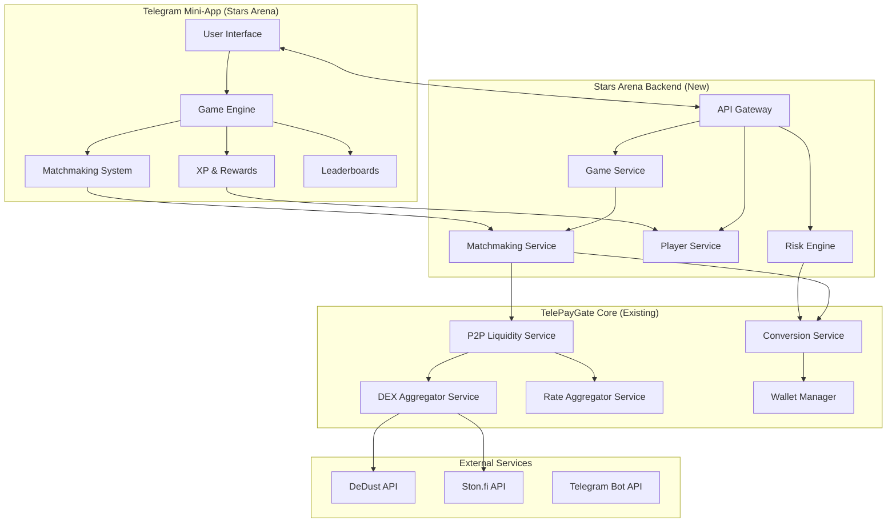
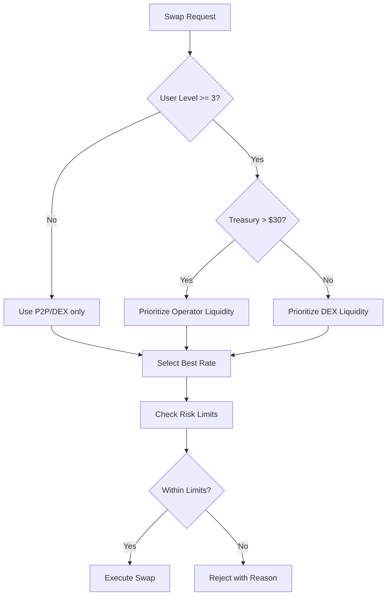

# Stars Arena: Gamified Stars⇄TON Exchange
## Comprehensive Phased Implementation Plan

**Project Goal**: Transform TelePayGate into a tiny-liquidity, viral, gamified Stars⇄TON exchange via Telegram mini-app with strict risk controls under $50 USD initial capital.

**Document Version**: 1.0
**Last Updated**: 2026-01-07
**Target Platform**: Telegram Mini-App (Web App)

---

## Executive Summary

Stars Arena wraps TelePayGate's existing P2P/DEX engine with a game loop that treats swaps as "matches" between players. The system starts with the operator as the only real liquidity provider (under $50 USD in TON), while treating all other "liquidity" as rate-limited, small-sized user-to-user swaps routed through existing P2P and DEX aggregator services.

### Key Design Principles

1. **Tiny Liquidity Strategy**: Start with $40-50 USD in TON, use external DEX liquidity (DeDust/Ston.fi) for larger swaps
2. **Game-First UX**: Every swap is a "match" with timers, streaks, XP, and badges
3. **Risk-First Architecture**: Strict per-user caps, rate limits, and automatic liquidity floor protection
4. **Viral Mechanics**: Leaderboards, achievements, and social features drive organic growth

---

## System Architecture Overview



---

## Phase 1: Foundation & Risk Controls (Days 1-7)

### 1.1 Risk Engine Implementation

**Objective**: Implement strict risk controls to protect the under-$50 liquidity buffer.

**Tasks**:

- Create `risk-engine.service.ts` in `@tg-payment/core`
  - Track real-time TON exposure across all pending conversions
  - Implement per-user swap limits (configurable via env)
  - Implement daily volume caps per user
  - Implement liquidity floor protection (auto-reduce limits when TON < $10)

- Add database migration for risk tracking:
  ```sql
  CREATE TABLE risk_metrics (
    id uuid PRIMARY KEY DEFAULT gen_random_uuid(),
    user_id uuid NOT NULL,
    metric_type TEXT NOT NULL, -- 'daily_volume', 'pending_exposure', 'swap_count'
    metric_value numeric NOT NULL,
    window_start timestamptz NOT NULL,
    window_end timestamptz NOT NULL,
    created_at timestamptz NOT NULL DEFAULT NOW()
  );

  CREATE TABLE risk_limits (
    id uuid PRIMARY KEY DEFAULT gen_random_uuid(),
    user_id uuid NULL, -- NULL = global default
    limit_type TEXT NOT NULL, -- 'max_swap_size', 'daily_cap', 'max_pending'
    limit_value numeric NOT NULL,
    is_active boolean DEFAULT true,
    created_at timestamptz NOT NULL DEFAULT NOW()
  );
  ```

- Environment variables for risk controls:
  ```env
  # Risk Engine Configuration
  RISK_ENGINE_ENABLED=true
  MAX_SWAP_SIZE_STARS=5000        # Maximum Stars per swap
  MAX_SWAP_SIZE_TON=0.1           # Maximum TON per swap (~$0.50)
  DAILY_CAP_STARS=20000           # Daily Stars cap per user
  MAX_PENDING_CONVERSIONS=3        # Max concurrent swaps per user
  LIQUIDITY_FLOOR_USD=10          # Auto-reduce limits when below this
  OPERATOR_TON_BALANCE_THRESHOLD=50 # Total operator TON cap
  ```

**Acceptance Criteria**:
- Risk engine rejects swaps that would exceed per-user limits
- System automatically reduces limits when operator TON balance drops below floor
- All risk metrics are logged for audit

### 1.2 Stars Arena Backend API

**Objective**: Create new API endpoints specifically for the mini-app.

**Tasks**:

- Create `@tg-payment/arena` package structure:
  ```
  packages/arena/
  ├── src/
  │   ├── controllers/
  │   │   ├── arena.controller.ts
  │   │   ├── matchmaking.controller.ts
  │   │   └── leaderboard.controller.ts
  │   ├── services/
  │   │   ├── arena-game.service.ts
  │   │   ├── matchmaking.service.ts
  │   │   ├── xp-rewards.service.ts
  │   │   └── leaderboard.service.ts
  │   ├── middleware/
  │   │   └── telegram-auth.middleware.ts
  │   └── types/
  │       └── arena.types.ts
  ```

- Implement core arena endpoints:
  ```typescript
  // Arena Controller
  POST   /api/v1/arena/join              # Initialize player profile
  GET    /api/v1/arena/profile           # Get player stats, XP, badges
  POST   /api/v1/arena/quote            # Get quote with game context
  POST   /api/v1/arena/match            # Create swap as "match"
  GET    /api/v1/arena/match/:id        # Get match status with game state
  GET    /api/v1/arena/history          # Get swap history with XP earned

  // Matchmaking Controller
  GET    /api/v1/arena/matchmaking/search # Search for best pool/route
  GET    /api/v1/arena/matchmaking/pools # Get available pools with gamified names

  // Leaderboard Controller
  GET    /api/v1/arena/leaderboard      # Get top players
  GET    /api/v1/arena/leaderboard/friends # Get friends leaderboard
  ```

- Database migrations for gamification:
  ```sql
  -- Player profiles
  CREATE TABLE arena_players (
    id uuid PRIMARY KEY DEFAULT gen_random_uuid(),
    user_id uuid NOT NULL UNIQUE REFERENCES users(id),
    telegram_id bigint NOT NULL,
    username TEXT,
    xp bigint DEFAULT 0,
    level int DEFAULT 1,
    streak_current int DEFAULT 0,
    streak_best int DEFAULT 0,
    matches_completed bigint DEFAULT 0,
    volume_stars bigint DEFAULT 0,
    volume_ton numeric(30,18) DEFAULT 0,
    created_at timestamptz NOT NULL DEFAULT NOW(),
    updated_at timestamptz NOT NULL DEFAULT NOW()
  );

  -- XP rewards log
  CREATE TABLE arena_xp_rewards (
    id uuid PRIMARY KEY DEFAULT gen_random_uuid(),
    player_id uuid NOT NULL REFERENCES arena_players(id),
    conversion_id uuid REFERENCES conversions(id),
    xp_earned int NOT NULL,
    reason TEXT NOT NULL, -- 'match_completed', 'streak_bonus', 'first_swap'
    created_at timestamptz NOT NULL DEFAULT NOW()
  );

  -- Badges/achievements
  CREATE TABLE arena_badges (
    id uuid PRIMARY KEY DEFAULT gen_random_uuid(),
    name TEXT NOT NULL UNIQUE,
    description TEXT,
    icon_url TEXT,
    xp_reward int DEFAULT 0,
    requirement_type TEXT, -- 'swaps', 'volume', 'streak'
    requirement_value int,
    is_active boolean DEFAULT true
  );

  CREATE TABLE arena_player_badges (
    id uuid PRIMARY KEY DEFAULT gen_random_uuid(),
    player_id uuid NOT NULL REFERENCES arena_players(id),
    badge_id uuid NOT NULL REFERENCES arena_badges(id),
    earned_at timestamptz NOT NULL DEFAULT NOW(),
    UNIQUE(player_id, badge_id)
  );

  -- Leaderboard snapshots
  CREATE TABLE arena_leaderboard_snapshots (
    id uuid PRIMARY KEY DEFAULT gen_random_uuid(),
    player_id uuid NOT NULL REFERENCES arena_players(id),
    rank int NOT NULL,
    xp bigint NOT NULL,
    snapshot_type TEXT NOT NULL, -- 'daily', 'weekly', 'all_time'
    snapshot_date timestamptz NOT NULL DEFAULT NOW()
  );
  ```

**Acceptance Criteria**:
- All arena endpoints are functional and tested
- Player profiles are created on first mini-app launch
- XP is awarded on successful conversions

### 1.3 Telegram Authentication Middleware

**Objective**: Secure mini-app access using Telegram's WebApp authentication.

**Tasks**:

- Implement `telegram-auth.middleware.ts`:
  ```typescript
  interface TelegramWebAppInitData {
    query_id?: string;
    user?: {
      id: number;
      first_name: string;
      last_name?: string;
      username?: string;
      language_code?: string;
      is_premium?: boolean;
    };
    auth_date: number;
    hash: string;
  }

  // Verify Telegram signature
  async function verifyTelegramAuth(initData: string): Promise<boolean>
  ```

- Create helper to extract user ID and validate signature

**Acceptance Criteria**:
- Middleware validates Telegram WebApp init data
- Invalid signatures are rejected with 401
- User context is attached to request

---

## Phase 2: Game Mechanics & Matchmaking (Days 8-14)

### 2.1 Matchmaking System

**Objective**: Route swaps through P2P/DEX with gamified "match" narrative.

**Tasks**:

- Implement `matchmaking.service.ts`:
  ```typescript
  interface MatchRequest {
    userId: string;
    starsAmount: number;
    targetCurrency: string;
  }

  interface MatchResult {
    matchId: string;
    opponent: {
      type: 'user' | 'pool' | 'dex';
      name: string; // "Whale #23", "DeDust Pro Pool"
      avatar: string;
    };
    rate: number;
    estimatedTime: number;
    confidence: number; // 0-1
    route: LiquiditySource[];
  }
  ```

- Gamified pool naming system:
  - P2P orders: "Trader #X" or "Whale #X" based on volume
  - DeDust: "DeDust Pro Pool"
  - Ston.fi: "Ston.fi Elite Pool"
  - Operator liquidity: "Arena Treasury"

- Implement "Searching for best pool..." animation state

**Acceptance Criteria**:
- Matchmaking returns gamified opponent information
- Route selection respects risk engine limits
- User-to-user matching is prioritized when available

### 2.2 Game Loop Implementation

**Objective**: Create engaging game loop around swap execution.

**Tasks**:

- Implement `arena-game.service.ts` with game states:
  ```typescript
  enum MatchState {
    SEARCHING = 'searching',      // Finding best rate
    RATE_LOCKED = 'rate_locked',   // 5-minute countdown
    AWAITING_TON = 'awaiting_ton', // Waiting for TON deposit
    CONFIRMING = 'confirming',     // Blockchain confirmations
    COMPLETED = 'completed',       // Success!
    FAILED = 'failed'             // Error state
  }

  interface GameSession {
    matchId: string;
    state: MatchState;
    rateLockExpiresAt: Date;
    opponent: OpponentInfo;
    progress: number; // 0-100
    startTime: Date;
  }
  ```

- Implement streak system:
  - Track consecutive successful swaps within 24-hour window
  - Award bonus XP for streaks (2x, 3x, etc.)
  - Reset streak on failed swap or 24-hour gap

- Implement timer synchronization:
  - Frontend countdown matches backend `RATE_LOCK_DURATION_SECONDS`
  - Visual countdown with urgency effects as time expires

**Acceptance Criteria**:
- Game state transitions are smooth and predictable
- Streaks are tracked and bonuses awarded
- Rate lock expiration is handled gracefully

### 2.3 XP & Rewards System

**Objective**: Reward players for engagement and successful swaps.

**Tasks**:

- Implement `xp-rewards.service.ts`:
  ```typescript
  interface XPRewardConfig {
    baseSwap: 10,           // XP per successful swap
    volumeBonus: 1,         // XP per 1000 Stars
    streakMultiplier: 0.5,   // Additional XP per streak level
    firstSwap: 100,         // Bonus for first swap
    dailyBonus: 50,         // Bonus for 5 swaps in a day
  }

  interface LevelConfig {
    level: number;
    xpRequired: number;
    maxSwapSize: number;    // Increase limits with level
    dailyCap: number;       // Increase caps with level
  }
  ```

- Implement level progression:
  - Level 1: 0 XP, max swap 1000 Stars, daily cap 5000 Stars
  - Level 2: 100 XP, max swap 2000 Stars, daily cap 10000 Stars
  - Level 3: 300 XP, max swap 3000 Stars, daily cap 15000 Stars
  - (Continue scaling)

- Implement badge system:
  - "First Swap": Complete first conversion
  - "Streak Master": 5+ consecutive swaps
  - "Whale Hunter": Match with high-volume P2P order
  - "Speed Demon": Complete swap in under 2 minutes
  - "DEX Navigator": Route through DeDust or Ston.fi

**Acceptance Criteria**:
- XP is awarded correctly for all actions
- Level progression unlocks higher limits
- Badges are awarded when criteria met

---

## Phase 3: Telegram Mini-App Frontend (Days 15-21)

### 3.1 Mini-App Setup & Architecture

**Objective**: Initialize Telegram WebApp with proper configuration.

**Tasks**:

- Create `@tg-payment/arena-web` package (React + Vite):
  ```
  packages/arena-web/
  ├── src/
  │   ├── components/
  │   ├── pages/
  │   ├── hooks/
  │   ├── services/
  │   ├── stores/
  │   └── main.tsx
  ├── public/
  └── package.json
  ```

- Configure Telegram WebApp SDK:
  ```typescript
  import WebApp from '@twa-dev/sdk';

  // Initialize
  WebApp.ready();
  WebApp.expand();

  // Theme integration
  const colorScheme = WebApp.colorScheme; // 'light' or 'dark'
  const themeParams = WebApp.themeParams;
  ```

- Set up routing:
  - `/` - Home/Lobby
  - `/match` - Active match
  - `/profile` - Player profile
  - `/leaderboard` - Rankings
  - `/history` - Swap history

**Acceptance Criteria**:
- Mini-app launches within Telegram
- Theme adapts to Telegram's color scheme
- Navigation is smooth and intuitive

### 3.2 Core UI Components

**Objective**: Build reusable components for the game interface.

**Tasks**:

- Create key components:
  ```typescript
  // MatchmakingScreen
  <MatchmakingScreen>
    <PoolSearchAnimation />
    <PoolCard name="DeDust Pro Pool" rate="0.00099" />
    <PoolCard name="Whale #23" rate="0.00100" />
  </MatchmakingScreen>

  // ActiveMatchScreen
  <ActiveMatchScreen>
    <OpponentCard name="Whale #23" avatar="..." />
    <RateLockTimer expiresAt={date} />
    <SwapProgress state="awaiting_ton" progress={50} />
    <TONDepositAddress address="EQ..." />
  </ActiveMatchScreen>

  // XPRewardPopup
  <XPRewardPopup xp={50} reason="Streak Bonus!" />

  // LeaderboardTable
  <LeaderboardTable players={[...]} />
  ```

- Implement animations:
  - Pool search loading animation
  - Match success celebration
  - XP earned popup
  - Streak counter animation

**Acceptance Criteria**:
- All components are responsive and theme-aware
- Animations are smooth (60fps)
- Components are accessible

### 3.3 Game Screens Implementation

**Objective**: Build complete game flow screens.

**Tasks**:

- **Home/Lobby Screen**:
  - Player stats summary (XP, level, streak)
  - Quick swap button
  - Daily challenges
  - Leaderboard preview

- **Matchmaking Screen**:
  - Input Stars amount
  - "Searching for best pool..." animation
  - Pool options with rates and "opponent" info
  - Select pool and lock rate

- **Active Match Screen**:
  - Opponent display with avatar
  - 5-minute rate lock countdown
  - Progress indicator (searching → awaiting → confirming → completed)
  - TON deposit address with QR code
  - Real-time status updates via polling/websockets

- **Profile Screen**:
  - XP bar and level
  - Current streak
  - Badges collection
  - Stats summary

- **Leaderboard Screen**:
  - Tab switcher (Daily, Weekly, All-time)
  - Player ranking highlight
  - Friends leaderboard

**Acceptance Criteria**:
- All screens are functional and connected to backend
- Real-time updates work correctly
- UI is polished and engaging

---

## Phase 4: Leaderboards & Social Features (Days 22-28)

### 4.1 Leaderboard System

**Objective**: Implement competitive ranking system.

**Tasks**:

- Implement `leaderboard.service.ts`:
  ```typescript
  interface LeaderboardEntry {
    rank: number;
    player: {
      id: string;
      username: string;
      avatar: string;
    };
    xp: bigint;
    level: number;
    matchesCompleted: bigint;
    volumeStars: bigint;
  }

  interface LeaderboardQuery {
    type: 'daily' | 'weekly' | 'all_time';
    limit?: number;
    offset?: number;
    friendsOnly?: boolean;
  }
  ```

- Implement leaderboard snapshots:
  - Daily snapshot at midnight UTC
  - Weekly snapshot on Sunday
  - Store historical rankings

- Implement friend system:
  ```sql
  CREATE TABLE arena_friends (
    id uuid PRIMARY KEY DEFAULT gen_random_uuid(),
    player_id uuid NOT NULL REFERENCES arena_players(id),
    friend_id uuid NOT NULL REFERENCES arena_players(id),
    status TEXT NOT NULL DEFAULT 'pending', -- 'pending', 'accepted'
    created_at timestamptz NOT NULL DEFAULT NOW(),
    UNIQUE(player_id, friend_id)
  );
  ```

**Acceptance Criteria**:
- Leaderboards are accurate and update in real-time
- Friend leaderboards work correctly
- Historical rankings are preserved

### 4.2 Social Features

**Objective**: Add viral mechanics to drive growth.

**Tasks**:

- Implement referral system:
  ```sql
  CREATE TABLE arena_referrals (
    id uuid PRIMARY KEY DEFAULT gen_random_uuid(),
    referrer_id uuid NOT NULL REFERENCES arena_players(id),
    referred_id uuid NOT NULL REFERENCES arena_players(id),
    bonus_xp int DEFAULT 50,
    claimed boolean DEFAULT false,
    created_at timestamptz NOT NULL DEFAULT NOW()
  );
  ```

- Implement share features:
  - Share match results to Telegram
  - Invite friends via deep link
  - Share leaderboard achievements

- Implement notifications:
  - Friend passed you on leaderboard
  - Streak about to expire
  - New badge earned

**Acceptance Criteria**:
- Referral system tracks and awards correctly
- Share features work within Telegram
- Notifications are timely and relevant

---

## Phase 5: Testing & Deployment (Days 29-35)

### 5.1 Comprehensive Testing

**Objective**: Ensure system reliability and security.

**Tasks**:

- **Unit Tests**:
  - Risk engine limits and calculations
  - XP rewards and level progression
  - Matchmaking route selection
  - Badge awarding logic

- **Integration Tests**:
  - End-to-end swap flow (Stars → TON)
  - Risk engine integration with conversions
  - Leaderboard snapshot generation
  - Telegram authentication flow

- **Load Testing**:
  - Simulate 100 concurrent users
  - Test rate limiting
  - Verify risk engine under load

- **Security Tests**:
  - Telegram signature verification
  - API key authentication
  - SQL injection prevention
  - Rate limit bypass attempts

**Acceptance Criteria**:
- All tests pass with >90% coverage
- Load tests meet performance targets
- Security tests find no critical vulnerabilities

### 5.2 Deployment Configuration

**Objective**: Deploy to production with proper infrastructure.

**Tasks**:

- **Backend Deployment** (Railway/Render):
  ```yaml
  # railway.json additions
  {
    "services": {
      "arena-api": {
        "env": {
          "RISK_ENGINE_ENABLED": "true",
          "MAX_SWAP_SIZE_STARS": "5000",
          "MAX_SWAP_SIZE_TON": "0.1",
          "DAILY_CAP_STARS": "20000",
          "MAX_PENDING_CONVERSIONS": "3"
        }
      }
    }
  }
  ```

- **Frontend Deployment** (Vercel/Netlify):
  - Configure Telegram WebApp domain
  - Set up environment variables
  - Enable CDN for assets

- **Database Migrations**:
  - Run all new migrations
  - Seed initial badges
  - Create default risk limits

- **Monitoring Setup**:
  - Error tracking (Sentry)
  - Performance monitoring (Datadog)
  - Uptime monitoring (Pingdom)
  - Custom alerts for risk threshold breaches

**Acceptance Criteria**:
- All services are deployed and accessible
- Database is properly migrated
- Monitoring is active and alerting

### 5.3 Initial Liquidity Setup

**Objective**: Fund the system with initial $40-50 USD in TON.

**Tasks**:

- Create operator wallet:
  ```bash
  # Generate new wallet for arena treasury
  npm run wallet:create

  # Fund with 40-50 USD worth of TON
  # At $5/TON, that's 8-10 TON
  ```

- Configure treasury tracking:
  ```sql
  CREATE TABLE arena_treasury (
    id uuid PRIMARY KEY DEFAULT gen_random_uuid(),
    wallet_address text NOT NULL,
    balance_ton numeric(30,18) NOT NULL,
    balance_usd numeric(30,18) NOT NULL,
    last_updated timestamptz NOT NULL DEFAULT NOW()
  );
  ```

- Set up automatic treasury monitoring:
  - Alert when balance < $10 USD
  - Auto-reduce swap limits
  - Log all treasury movements

**Acceptance Criteria**:
- Treasury is funded with initial capital
- Monitoring is active
- Risk engine responds to treasury changes

---

## Phase 6: Launch & Growth (Days 36-42)

### 6.1 Soft Launch

**Objective**: Test with limited audience before full launch.

**Tasks**:

- Create beta tester list
- Generate referral codes for testers
- Monitor system performance
- Collect feedback and iterate

**Acceptance Criteria**:
- 50+ beta testers active
- System stable for 7 days
- Critical bugs resolved

### 6.2 Full Launch

**Objective**: Public launch of Stars Arena.

**Tasks**:

- Submit to Telegram Apps Center
- Create launch announcement
- Enable referral program
- Start marketing campaign

**Acceptance Criteria**:
- App approved by Telegram
- Marketing materials ready
- Referral program live

### 6.3 Post-Launch Monitoring

**Objective**: Ensure system health and user satisfaction.

**Tasks**:

- Daily metrics review:
  - Active users
  - Swap volume
  - Treasury balance
  - Risk limit breaches

- Weekly reports:
  - User growth
  - Retention rates
  - Revenue/fees
  - Bug reports

- Monthly optimization:
  - Adjust risk limits based on data
  - Add new badges/achievements
  - Improve matchmaking algorithms

**Acceptance Criteria**:
- Metrics dashboards are functional
- Reports are generated automatically
- Optimization cycle is established

---

## Database Schema Summary

### New Tables

| Table | Purpose |
|--------|---------|
| `arena_players` | Player profiles, XP, levels, streaks |
| `arena_xp_rewards` | XP earning history |
| `arena_badges` | Badge/achievement definitions |
| `arena_player_badges` | Player's earned badges |
| `arena_leaderboard_snapshots` | Historical rankings |
| `arena_friends` | Friend relationships |
| `arena_referrals` | Referral tracking |
| `arena_treasury` | Treasury balance tracking |
| `risk_metrics` | Risk tracking per user |
| `risk_limits` | Configurable risk limits |

### Modified Tables

| Table | Changes |
|--------|---------|
| `conversions` | Add `match_id`, `opponent_type`, `opponent_name` |
| `users` | Add `telegram_id` for mini-app linking |

---

## API Endpoints Summary

### Arena Endpoints

| Method | Endpoint | Description |
|--------|----------|-------------|
| POST | `/api/v1/arena/join` | Initialize player profile |
| GET | `/api/v1/arena/profile` | Get player stats |
| POST | `/api/v1/arena/quote` | Get quote with game context |
| POST | `/api/v1/arena/match` | Create swap as match |
| GET | `/api/v1/arena/match/:id` | Get match status |
| GET | `/api/v1/arena/history` | Get swap history |

### Matchmaking Endpoints

| Method | Endpoint | Description |
|--------|----------|-------------|
| GET | `/api/v1/arena/matchmaking/search` | Search for best pool |
| GET | `/api/v1/arena/matchmaking/pools` | Get available pools |

### Leaderboard Endpoints

| Method | Endpoint | Description |
|--------|----------|-------------|
| GET | `/api/v1/arena/leaderboard` | Get top players |
| GET | `/api/v1/arena/leaderboard/friends` | Get friends leaderboard |

### Social Endpoints

| Method | Endpoint | Description |
|--------|----------|-------------|
| POST | `/api/v1/arena/friends/request` | Send friend request |
| POST | `/api/v1/arena/friends/accept` | Accept friend request |
| GET | `/api/v1/arena/referrals` | Get referral link |
| POST | `/api/v1/arena/referrals/claim` | Claim referral bonus |

---

## Risk Management Strategy

### Liquidity Protection

1. **Initial Treasury**: $40-50 USD in TON
2. **Floor Threshold**: $10 USD (auto-reduce limits below this)
3. **Per-Swap Limit**: Max 0.1 TON (~$0.50)
4. **Daily Cap**: Max 20,000 Stars per user
5. **Pending Limit**: Max 3 concurrent swaps per user

### Route Selection Logic



### Slippage Protection

- Always show quote from `POST /api/v1/conversions/quote`
- Expire quotes aggressively (5-minute lock)
- Reject if price moves >2% from locked rate
- Display "Market shock! New round starting" on price movement

---

## Gamification Mechanics

### XP System

| Action | XP Award |
|--------|----------|
| First swap | +100 |
| Successful swap | +10 |
| Volume bonus (per 1000 Stars) | +1 |
| Streak bonus (per streak level) | +5 |
| Daily bonus (5 swaps) | +50 |

### Level Progression

| Level | XP Required | Max Swap | Daily Cap |
|-------|-------------|-----------|-----------|
| 1 | 0 | 1,000 Stars | 5,000 Stars |
| 2 | 100 | 2,000 Stars | 10,000 Stars |
| 3 | 300 | 3,000 Stars | 15,000 Stars |
| 4 | 600 | 4,000 Stars | 20,000 Stars |
| 5 | 1,000 | 5,000 Stars | 25,000 Stars |

### Badge System

| Badge | Requirement | XP Bonus |
|-------|-------------|----------|
| First Swap | Complete 1 swap | +50 |
| Streak Master | 5+ consecutive swaps | +100 |
| Whale Hunter | Match with high-volume P2P order | +75 |
| Speed Demon | Complete swap in <2 minutes | +50 |
| DEX Navigator | Route through DeDust/Ston.fi | +25 |
| Volume King | 100,000+ total Stars | +200 |

---

## Monitoring & Alerts

### Key Metrics

| Metric | Target | Alert Threshold |
|--------|--------|----------------|
| Treasury Balance | >$30 USD | <$10 USD |
| Swap Success Rate | >95% | <90% |
| Average Swap Time | <2 minutes | >5 minutes |
| Daily Active Users | Growing | <10% drop |
| Risk Limit Breaches | 0 | Any breach |

### Alert Channels

- Treasury: PagerDuty (immediate)
- System Errors: Slack (5 min)
- Performance Degradation: Email (15 min)
- Business Metrics: Daily digest

---

## Security Considerations

### Authentication

- Telegram WebApp signature verification required
- API key authentication for backend services
- Rate limiting per user and IP

### Data Protection

- Encrypt sensitive user data at rest
- Use HTTPS for all communications
- Implement CORS properly

### Wallet Security

- Separate hot wallet for operations
- Cold wallet for treasury storage
- Regular key rotation
- Monitor for unusual activity

---

## Success Metrics

### Week 1-2 Targets

- 100+ registered players
- 500+ swaps completed
- Treasury balance stable
- Zero critical bugs

### Week 3-4 Targets

- 500+ registered players
- 2,000+ swaps completed
- 30%+ retention rate
- 10+ referrals per day

### Month 2-3 Targets

- 2,000+ registered players
- 10,000+ swaps completed
- 25%+ retention rate
- Treasury self-sustaining (fees cover operations)

---

## Appendix: Technical Stack

### Backend

- **Runtime**: Node.js 20+
- **Framework**: Express.js
- **Database**: PostgreSQL 16
- **ORM**: pg-promise
- **Blockchain**: @ton/ton, TonWeb

### Frontend

- **Framework**: React 18+
- **Build Tool**: Vite
- **State**: Zustand
- **UI**: Tailwind CSS
- **SDK**: @twa-dev/sdk

### Infrastructure

- **Hosting**: Railway (API), Vercel (Frontend)
- **Database**: Managed PostgreSQL
- **Monitoring**: Sentry, Datadog
- **CI/CD**: GitHub Actions

---

## Conclusion

This comprehensive plan transforms TelePayGate into a viral, gamified exchange while maintaining strict risk controls. The phased approach allows for iterative development and testing, ensuring each component is production-ready before moving to the next phase.

The tiny-liquidity strategy minimizes initial capital requirements while leveraging existing DEX infrastructure for larger swaps. The game loop creates engagement and virality through XP, badges, and leaderboards.

With proper execution, Stars Arena can become a self-sustaining platform that grows organically through user referrals and social competition.
